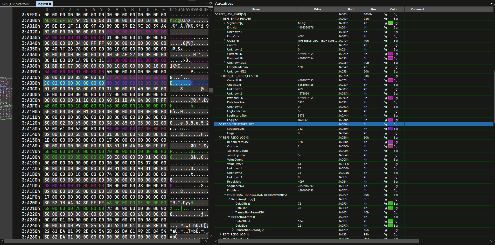
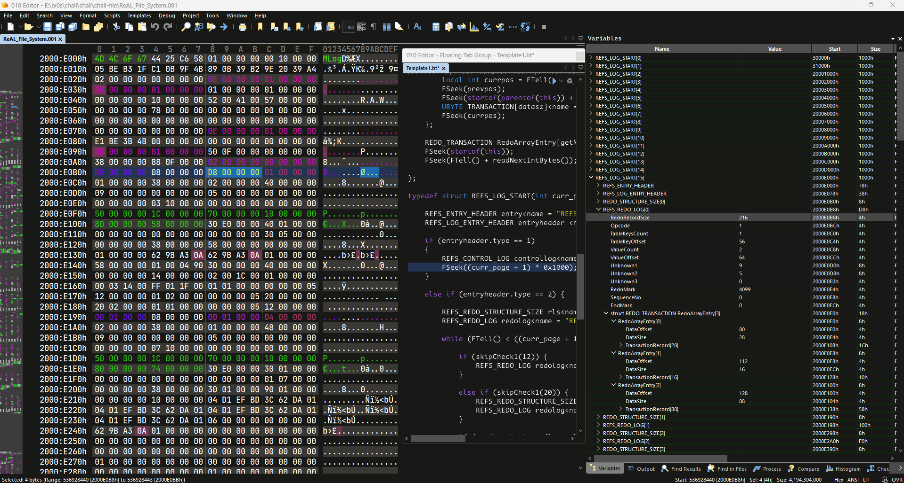

# ReFS-LogFile-010Editor

I have recently released a binary template for the [Resilient File System](https://www.sweetscape.com/010editor/repository/templates/file_info.php?file=ReFS.bt) and [ReFS LogFile](https://www.sweetscape.com/010editor/repository/templates/file_info.phpfile=LogFile.bt), designed to be used with the popular hex editor, **`010Editor`**.

 This template allows users to easily analyze and understand the structure of LogFile

- ReFS Entry Header
- ReFS Log Header
- The **redo** opcode
- RedoArrayEntry and TransactionRecord

## How to use it ?

You have two options: Either utilize it directly on the disk image or extract the logfile `MLog` from the disk image.
  
- Open the logfile or disk image.

- Either download the template from the official repository or navigate to `Templates` -> `New Template` and paste the `LogFile.bt` script.

- Execute the script.

## License 

[License](LICENSE)